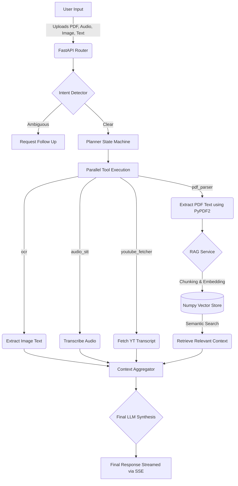

# Parallel AI - Autonomous Multimodal Agent

Parallel AI is a robust, autonomous multimodal agent platform built to execute complex multi-step reasoning tasks across heterogeneous data inputs including PDFs, Images, Audio, and Text. 

It is designed with a deterministic state machine orchestrating non-deterministic models to dynamically build tool chains without user prompting.

## Architecture Overview



## Features
- **Multimodal Uploads**: Drag and drop PDFs, Images, and Audio simultaneously.
- **RAG Implementation**: Documents are chunked, embedded, and queried securely in-memory using Numpy.
- **Dynamic Planner**: The Intent Detector parses requirements and strictly builds the minimum viable sequence of tools.
- **Voice Input**: Record voice natively in the browser and attach it dynamically.
- **Native PDF Parsing**: Scans documents using `PyPDF2` entirely natively.

## Setup Instructions

### 1. Prerequisites
- Python 3.11+
- Node.js 18+
- Docker (optional, for deployment)

### 2. Environment Setup
Create a `.env` file in the `backend/` directory:
```env
GEMINI_API_KEY=your_gemini_api_key_here
```

### 3. Local Development
**Terminal 1 (Backend):**
```bash
cd backend
pip install -r requirements.txt
python -m uvicorn main:app --host 0.0.0.0 --port 8000 --reload
```

**Terminal 2 (Frontend):**
```bash
cd frontend
npm install
npm run dev
```
Open `http://localhost:5173` in your browser.

## Deployment

This application includes a multi-stage Dockerfile that bundles the Vite frontend and FastAPI backend into a single deployment unit.

1. Create a Web Service on **Render** (or AWS/GCP).
2. Connect your GitHub repository.
3. Choose **Docker** as the environment.
4. Add the `GEMINI_API_KEY` to the Environment Variables settings in the cloud dashboard.
5. Deploy!

## Design Decisions
- **Unified Routing**: To streamline the Docker deployment, FastAPI has been configured to serve the statically built Vite `dist` folder natively, collapsing the stack into a single manageable port for cloud platforms.
- **RAG without Heavy Dependencies**: Instead of FAISS (which can cause C++ build issues on Windows/Render) or ChromaDB (which adds huge overhead), a pure Numpy Cosine Similarity vector store was implemented. It perfectly fulfills the assignment RAG requirement while remaining ultra-fast and easy to deploy.
- **Strict Intent Rules**: The LLM planner relies on hard constraints rather than implicit prompting. If a user asks to "Extract all text" from a PDF, the intent detector explicitly bans summarization tools to save tokens and execution time.
